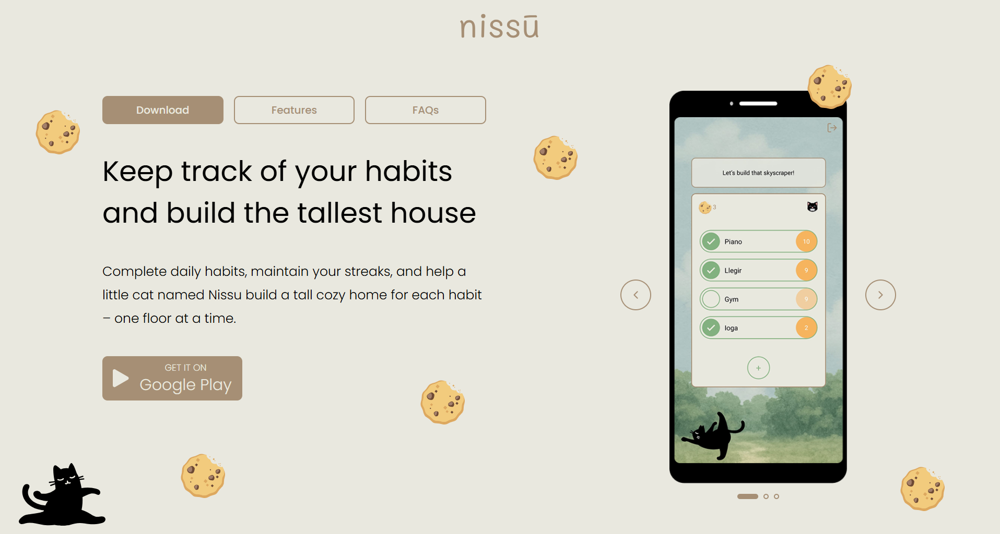

# Nissu – Build Your Habits, Floor by Floor

## Overview

This is the **landing page** for my React Native app, [**Nissu**](https://nissu-landing.vercel.app/): a gamified habit tracker where each streak adds a floor to your house.

I wanted the landing to reflect the playful, interactive spirit of the app — simple but with delightful details.

## Tech Stack

- **Astro** – for SEO-friendly static site generation and SSR
- **React** – for interactive components like the cat and carousel
- **Tailwind CSS** – for utility-first, responsive styling
- **Figma** – for layout and visual design

## Features

This is a simple landing page but I wanted to make it **interactive** to go with my app, so I implemented fun stuff such as when Although it's a basic landing page, I added some **fun interactions** to make it engaging:

- **Clickable cat** that spawns cookies randomly on the screen
- **Sound effects** when interacting with the cat and cookies
- **Image carousel** showcasing the app
- **Tabs** to switch between app features and information

All animations and interactions are subtle and responsive, in line with the app’s soft and warm design.

## Links

- [Go to landing page](https://nissu-landing.vercel.app/)
- [Go to Nissu app repo](https://github.com/annahilla/nissu)
